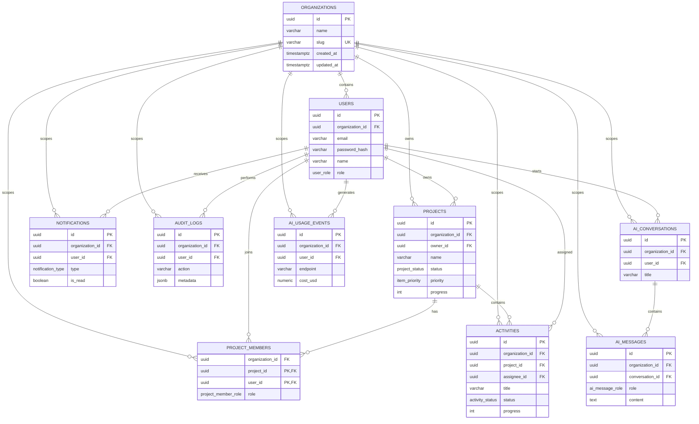

# ProjectManager SaaS — Entity Relationship Diagram

```mermaid
erDiagram
    ORGANIZATIONS ||--o{ USERS : contains
    ORGANIZATIONS ||--o{ PROJECTS : owns
    ORGANIZATIONS ||--o{ PROJECT_MEMBERS : scopes
    ORGANIZATIONS ||--o{ ACTIVITIES : scopes
    ORGANIZATIONS ||--o{ NOTIFICATIONS : scopes
    ORGANIZATIONS ||--o{ AUDIT_LOGS : scopes
    ORGANIZATIONS ||--o{ AI_CONVERSATIONS : scopes
    ORGANIZATIONS ||--o{ AI_MESSAGES : scopes
    ORGANIZATIONS ||--o{ AI_USAGE_EVENTS : scopes

    USERS ||--o{ PROJECTS : owns
    USERS ||--o{ PROJECT_MEMBERS : joins
    PROJECTS ||--o{ PROJECT_MEMBERS : has
    PROJECTS ||--o{ ACTIVITIES : contains
    USERS ||--o{ ACTIVITIES : assigned
    USERS ||--o{ NOTIFICATIONS : receives
    USERS ||--o{ AUDIT_LOGS : performs
    USERS ||--o{ AI_CONVERSATIONS : starts
    AI_CONVERSATIONS ||--o{ AI_MESSAGES : contains
    USERS ||--o{ AI_USAGE_EVENTS : generates

    ORGANIZATIONS {
        uuid id PK
        varchar name
        varchar slug UK
        timestamptz created_at
        timestamptz updated_at
    }
    USERS {
        uuid id PK
        uuid organization_id FK
        varchar email
        varchar password_hash
        varchar name
        user_role role
    }
    PROJECTS {
        uuid id PK
        uuid organization_id FK
        uuid owner_id FK
        varchar name
        project_status status
        item_priority priority
        int progress
    }
    PROJECT_MEMBERS {
        uuid organization_id FK
        uuid project_id PK,FK
        uuid user_id PK,FK
        project_member_role role
    }
    ACTIVITIES {
        uuid id PK
        uuid organization_id FK
        uuid project_id FK
        uuid assignee_id FK
        varchar title
        activity_status status
        int progress
    }
    NOTIFICATIONS {
        uuid id PK
        uuid organization_id FK
        uuid user_id FK
        notification_type type
        boolean is_read
    }
    AUDIT_LOGS {
        uuid id PK
        uuid organization_id FK
        uuid user_id FK
        varchar action
        jsonb metadata
    }
    AI_CONVERSATIONS {
        uuid id PK
        uuid organization_id FK
        uuid user_id FK
        varchar title
    }
    AI_MESSAGES {
        uuid id PK
        uuid organization_id FK
        uuid conversation_id FK
        ai_message_role role
        text content
    }
    AI_USAGE_EVENTS {
        uuid id PK
        uuid organization_id FK
        uuid user_id FK
        varchar endpoint
        numeric cost_usd
    }
```

All tenant-scoped relationships use `organization_id` in their foreign-key constraints to prevent cross-organization references.
